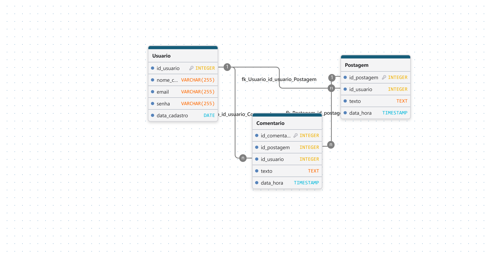

# Projeto de Banco de Dados (parte 2)

**Nome do Projeto:** Rede Social Conecta  
**Equipe de Desenvolvimento:** Dom Johnny Studios

## 1~Visão Geral do Sistema (Escopo)

A Rede Social Conecta tem como objetivo permitir que seus usuários possam criar uma conta, realizar postagens e interagir por meio de comentários. O sistema será responsável por armazenar e organizar as informações dos usuários, das postagens realizadas e dos comentários feitos nas publicações.

A plataforma permitirá que cada usuário tenha seu próprio cadastro e possa criar diversas postagens. Outros usuários poderão visualizar as publicações e realizar comentários, possibilitando uma interação simples entre os usuários da rede social.

## 2~Regras de Negócio

**RN01:** O sistema deve gerenciar o cadastro dos usuários. As informações necessárias para o cadastro são:

-   Nome completo
    
-   E-mail
    
-   Senha
    
-   Data de cadastro
    

**RN02:** O sistema deve permitir que os usuários criem postagens. As informações necessárias são:

-   Texto da postagem
    
-   Data e hora da publicação
    
-   Usuário responsável pela postagem
    

**RN03:** Cada postagem deve estar relacionada a apenas um usuário, sendo esse usuário identificado como o autor da publicação.

**RN04:** Um usuário poderá realizar várias postagens dentro do sistema.

**RN05:** O sistema deve permitir que os usuários realizem comentários nas postagens. As informações necessárias são:

-   Texto do comentário
    
-   Data e hora do comentário
    
-   Usuário responsável pelo comentário
    
-   Postagem comentada
    

**RN06:** Cada comentário deve estar relacionado a apenas um usuário e a uma postagem.

**RN07:** Um usuário poderá realizar vários comentários em diferentes postagens.

**RN08:** Uma postagem poderá receber vários comentários de diferentes usuários.

**RN09:** O sistema deve permitir que o usuário edite ou exclua suas próprias postagens.

**RN10:** O sistema deve permitir que o usuário edite ou exclua seus próprios comentários.

## 3~Requisitos Funcionais

**RF01:** O sistema deve permitir o cadastro de novos usuários.

**RF02:** O sistema deve permitir a alteração dos dados cadastrados pelo usuário.

**RF03:** O sistema deve permitir a exclusão de um usuário.

**RF04:** O sistema deve permitir a criação de novas postagens.

**RF05:** O sistema deve permitir a visualização das postagens cadastradas.

**RF06:** O sistema deve permitir a edição de uma postagem pelo seu autor.

**RF07:** O sistema deve permitir a exclusão de uma postagem pelo seu autor.

**RF08:** O sistema deve permitir que usuários comentem nas postagens.

**RF09:** O sistema deve permitir a visualização dos comentários de uma postagem.

**RF10:** O sistema deve permitir que o autor edite seu comentário.

**RF11:** O sistema deve permitir que o autor exclua seu comentário.

**RF12:** O sistema deve identificar o usuário responsável por cada postagem.

**RF13:** O sistema deve identificar o usuário responsável por cada comentário.

## 4~Entidades do Sistema

### Usuário

Responsável pelo cadastro e pelas interações realizadas na rede social.

**Atributos:**

-   ID do usuário
    
-   Nome completo
    
-   E-mail
    
-   Senha
    
-   Data de cadastro
    

### Postagem

Representa uma publicação realizada por um usuário.

**Atributos:**

-   ID da postagem
    
-   Texto
    
-   Data e hora
    
-   ID do usuário
    

### Comentário

Representa uma interação realizada por um usuário em uma postagem.

**Atributos:**

-   ID do comentário
    
-   Texto
    
-   Data e hora
    
-   ID do usuário
    
-   ID da postagem
    

## 5~Relacionamentos

**Usuário → Postagem**

Um usuário pode criar várias postagens, porém cada postagem pertence a apenas um usuário.

**Cardinalidade:** 1:N

**Usuário → Comentário**

Um usuário pode realizar vários comentários, porém cada comentário pertence a apenas um usuário.

**Cardinalidade:** 1:N

**Postagem → Comentário**

Uma postagem pode receber vários comentários, porém cada comentário pertence a apenas uma postagem.

**Cardinalidade:** 1:N

## 6~Modelo Conceitual

O modelo conceitual deverá ser desenvolvido utilizando o **BrModelo**, representando as entidades, seus atributos, relacionamentos e respectivas cardinalidades.

O modelo deverá conter as seguintes entidades principais:

**USUÁRIO**

↓

**POSTAGEM**

↓

**COMENTÁRIO**

Além disso, deverá representar os relacionamentos:

-   Usuário **cria** Postagem
    
-   Usuário **faz** Comentário
    
-   Postagem **recebe** Comentário

## Modelagem Conceitual

## Modelagem Logica

